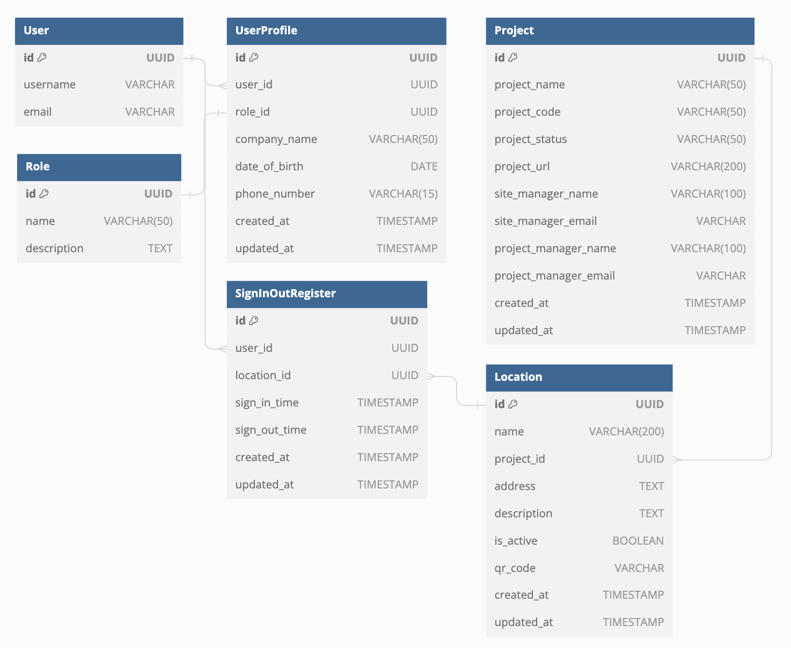

# QR Clock In/Out App

## Screenshot of finished project responsivness

## Emplyee/Subcontractor Clock In/Out App
> This is a simple app that allows employees to clock in and out of work using a QR code or by manual selection. The app enables the user to view their clock in/out history and also allows the admin to view all users clock in/out history. Admin have the ability to add project and the location associated with the project. 

Required technologies for this project: 

 - HTML, CSS, JavaScript, Python+Django
 - Relational database

# Live App
- https://qrsigninoutapp-c6f4e2915b2d.herokuapp.com/

## Table of Contents
<a name="contents">Back to top</a>
1. [UX]
2. [Features]
3. [Technologies Used]
4. [Testing]
5. [Deployment]
6. [Credits]

## UX

### User Demographic

This application is designed for employees and subcontractors to clock in and out of project locations. The app is designed to be used on a mobile device. It will enable companies to track the time spent on projects and the location of the employee/subcontractor.

### User Stories

### Database Schema

#### User Model (django.contrib.auth.models.User)
| id | Field |
|--|--|
| username |OneToOneField  |
| email |Charfield|

#### UserProfile Model
| id | Field |
|--|--|
| user |OneToOneField  |
| role |ForeignKey|
| company_name |Charfield|
| date_of_birth |Datefield|
| phone_number |Charfield|
| created_at |DateTimeField|
| updated_at |DateTimeField|

#### Role Model
| id | Field |
|--|--|
| name |Charfield  |
| description |Charfield|

#### Project Model
| id | Field |
|--|--|
| name |Charfield  |
| project_code |Charfield|
| project_status |Charfield|
| project_url |Charfield|
| site_manager_name |Charfield|
| site_manager_email |Charfield|
| project_manager_name |Charfield|
| project_manager_email |Charfield|
| created_at |DateTimeField|
| updated_at |DateTimeField|

#### Location Model
| id | Field |
|--|--|
| name |Charfield  |
| project |ForeignKey|
| address |Charfield|
| description |Charfield|
| is_active |BooleanField|
| qr_code |FileField|
| created_at |DateTimeField|
| updated_at |DateTimeField|

#### SignInOut Model
| id | Field |
|--|--|
| user |ForeignKey  |
| location |ForeignKey|
| sign_in_time |DateTimeField|
| sign_out_time |DateTimeField|
| created_at |DateTimeField|
| updated_at |DateTimeField|

###

### Design

### Wireframes

## Agile Development
Github projects was used for the agile development of this project. The purpose for this was to layout the tasks that needed to be completed and to track the progress of the project. 

## Credits
- Extending user model
https://docs.djangoproject.com/en/dev/topics/auth/customizing/#extending-the-existing-user-model
https://stackoverflow.com/questions/42478191/how-to-add-extra-fields-in-user-model-and-display-them-in-django-admin
- QRCode generator
https://www.geeksforgeeks.org/generate-qr-code-using-qrcode-in-python/
- Pylint for Django
- https://stackoverflow.com/questions/71986184/how-can-i-override-str-in-models-py
