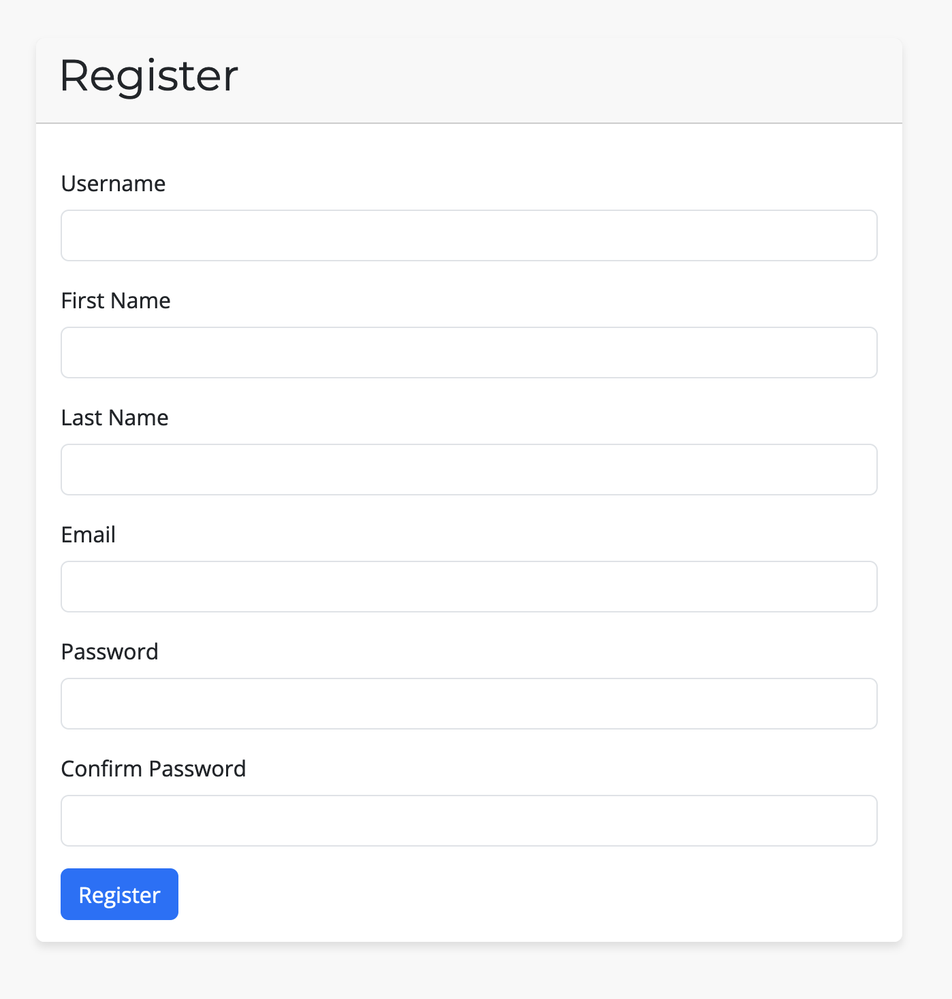
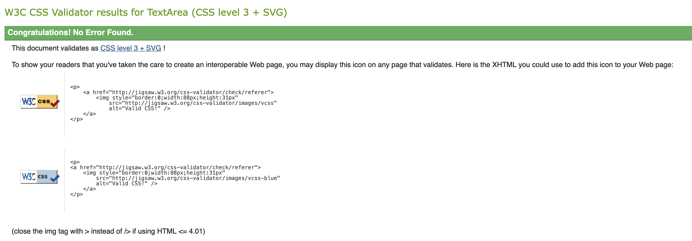
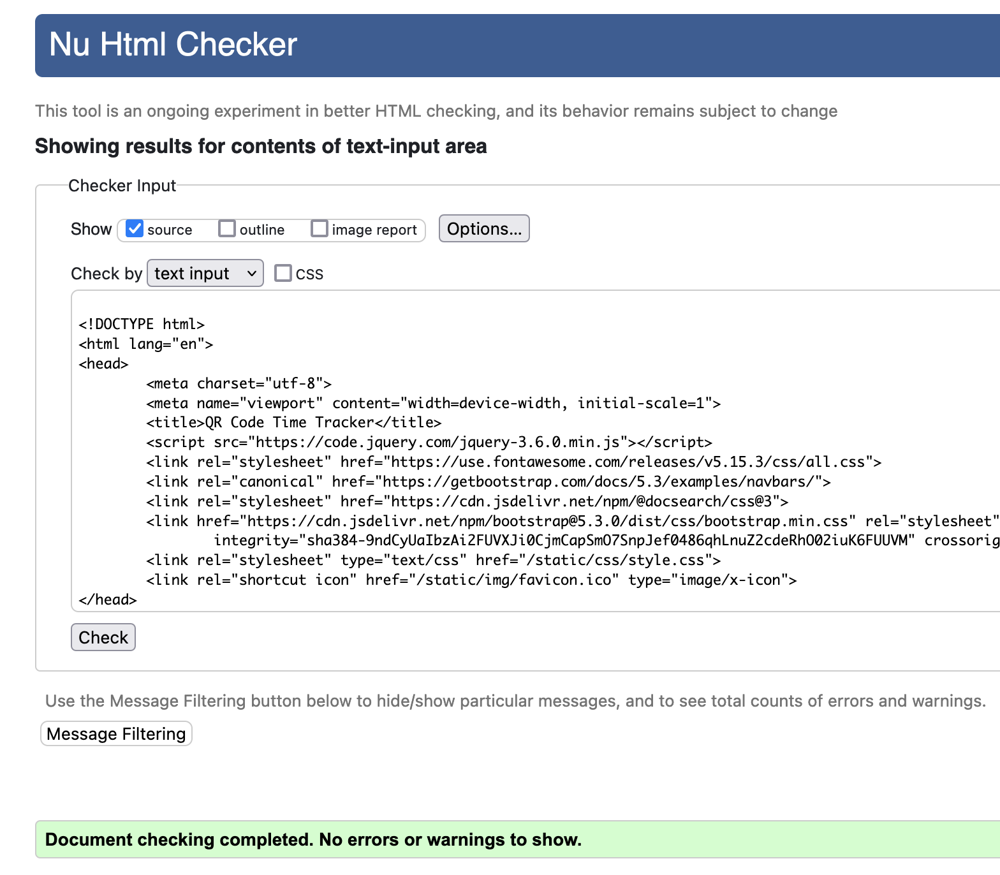
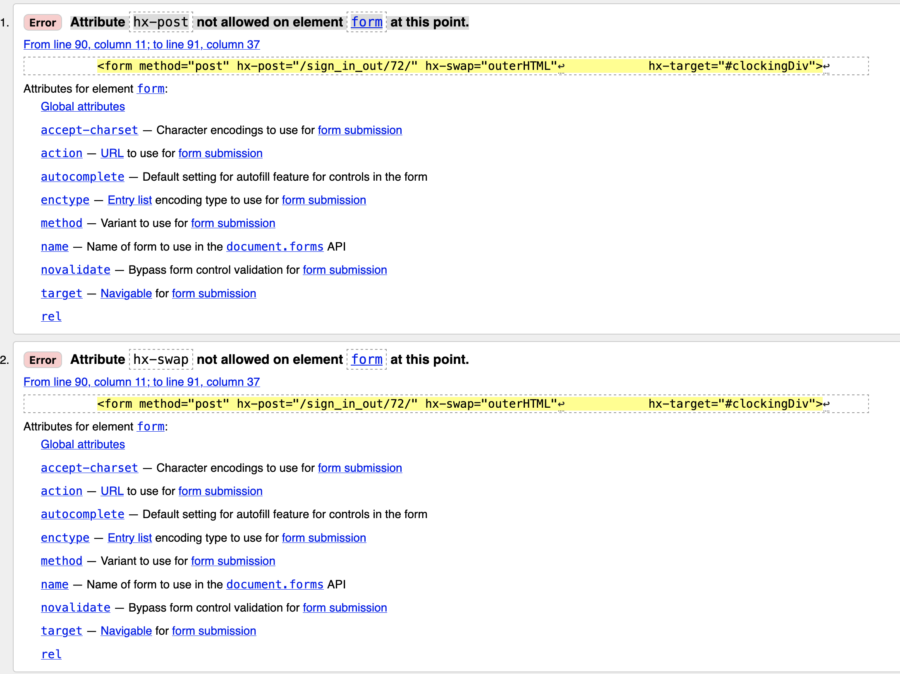
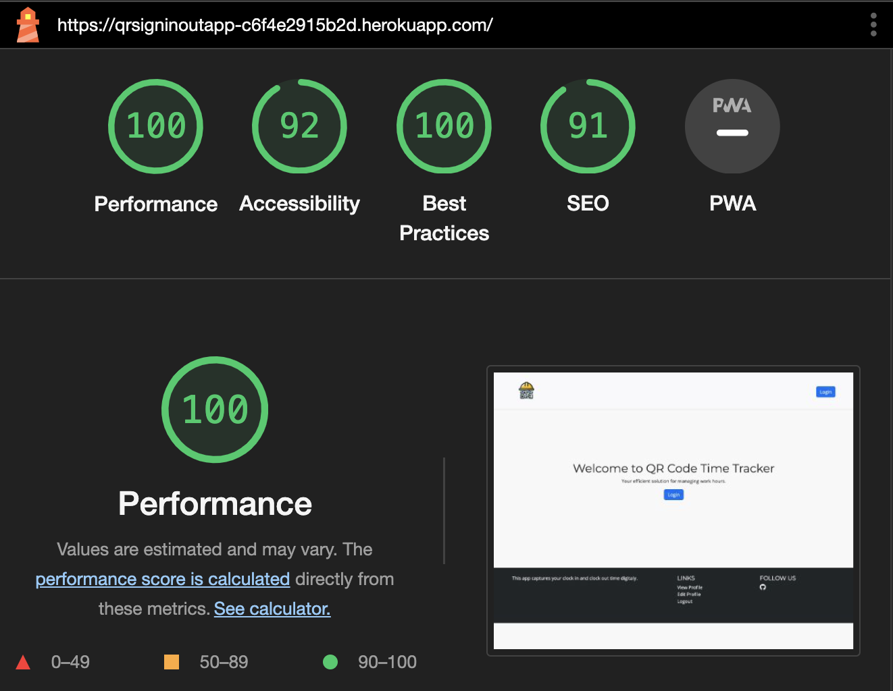

# QR Clock In/Out App

## Screenshot of finished project responsivness

## Employee/Subcontractor Clock In/Out App

> This is a simple app that allows employees to clock in and out of work using a QR code or by manual selection. The app enables the user to view their clock in/out history and also allows the admin to view all users clock in/out history. Admin have the ability to add project and the location associated with the project.

# Live App
- https://qrsigninoutapp-c6f4e2915b2d.herokuapp.com/

## Table of Contents

<a name="contents">Back to top</a>

1. [UX](#ux)
2. [User Demographic](#user-demographic)
3. [Wireframes](#wireframes)
4. [Design](#design)
5. [User Stories](#user-stories)
6. [Database Schema](#database-schema)
7. [Features](#features)
8. [Existing Features](#existing-features)
9. [Features Left to Implement](#features-left-to-implement)
10. [Technologies Used](#technologies)
11. [Agile Development](#agile-development)
12. [Testing](#testing)
13. [Bug](#bugs)
14. [Deployment](#deployment)
15. [Credits](#credits)

## UX

### User Demographic

This application is designed for employees and subcontractors to clock in and out of project locations. The app is designed to be used on a mobile device. It will enable companies to track the time spent on projects and the location of the employee/subcontractor.

### Wireframes
- Landing Page
  

- User Dashboard
  

- Select Project
  

- Create Project
  

- View/Edit Project
  

- View/Edit Profile
  

### Design

- Color Palette

  Charcoal Grey (#2a2a2a): Provides a strong, neutral base for text and key elements, ensuring excellent readability and a modern aesthetic.
  Vibrant Yellow (#FFD700): Used strategically for interactive elements and call-to-actions, this color stands out against the dark tones and captures user attention.

  This color scheme is professionalism with visual appeal, ensuring a clean and engaging user interface that reflects the efficiency and precision.

- Typography

  The typography choices reflect clarity and contemporary design, featuring:

  Montserrat: Chosen for headings due to its geometric simplicity and modern character, it enhances the visual impact of titles and section headers.
  Open Sans: Selected for body text, Open Sans is clean and legible, making reading seamless and comfortable across all devices.

  The fonts are selected not only for their visual harmony but also for their high readability, contributing to a user-friendly experience.

### User Stories

User stories can be found in the github projects board.
[User Stories](https://github.com/users/conroy9068/projects/3/views/1)

### Database Schema

#### User Model (django.contrib.auth.models.User)

| id       | Field         |
| -------- | ------------- |
| username | OneToOneField |
| email    | Charfield     |

#### UserProfile Model

| id            | Field         |
| ------------- | ------------- |
| user          | OneToOneField |
| role          | ForeignKey    |
| company_name  | Charfield     |
| date_of_birth | Datefield     |
| phone_number  | Charfield     |
| created_at    | DateTimeField |
| updated_at    | DateTimeField |

#### Role Model

| id          | Field     |
| ----------- | --------- |
| name        | Charfield |
| description | Charfield |

#### Project Model

| id                    | Field         |
| --------------------- | ------------- |
| name                  | Charfield     |
| project_code          | Charfield     |
| project_status        | Charfield     |
| project_url           | Charfield     |
| site_manager_name     | Charfield     |
| site_manager_email    | Charfield     |
| project_manager_name  | Charfield     |
| project_manager_email | Charfield     |
| created_at            | DateTimeField |
| updated_at            | DateTimeField |

#### Location Model

| id          | Field         |
| ----------- | ------------- |
| name        | Charfield     |
| project     | ForeignKey    |
| address     | Charfield     |
| description | Charfield     |
| is_active   | BooleanField  |
| qr_code     | FileField     |
| created_at  | DateTimeField |
| updated_at  | DateTimeField |

#### SignInOut Model

| id            | Field         |
| ------------- | ------------- |
| user          | ForeignKey    |
| location      | ForeignKey    |
| sign_in_time  | DateTimeField |
| sign_out_time | DateTimeField |
| created_at    | DateTimeField |
| updated_at    | DateTimeField |

## Features

### Existing Features

Landing Page, user can register or login.

Register page, user can register with their username, first name, last name, email address, password and confirm password.

Login page, user can login with their username and password.

Logout Confirmation, confirmation message to confirm logout.

Nav Bar, user can navigate to the home page, user dashboard, view profile, edit profile and logout. Admin Panel is only visable to staff users.

Footer, footer with links to the app github repository and the developer github profile.

User Dashboard, user can see their current clock in/out status and their clock in/out history.

Select Project, user can select a project and location to clock in/out.

Clocked Out, user can clock in/out of a project and location.

Clocked In, user can clock in/out of a project and location.

Admin Panel (Projects), admin can view all projects and allows them to select one to edit.

Admin Panel (Clock In/Out), admin can view users that are currently clocked in.

Create Project, admin can create a new project.

Edit Project and Locations, admin can edit a project and add locations to the project.

Delete Project, admin can delete a project.

Add Location, admin can add a location to a project.

Location Active & Delete Checkbox and QR Download

View Profile, user can view their profile information.

Edit Profile, user can edit their profile information.

### Features Left to Implement

- Add a clock in/out button to the user dashboard that will allow the user to open the clock out view of the current clocked in project to save them from having to navigate to the project selection page.

- Admin panel to allow the admin to view all users clock in/out history. This view would have a date filter range and allow the user to filter by subcontractor or company. This dashboard would have charts to display the data in a visual way.

- Subcontractor register, this would allow user to select/search a subcontractor name and set that as their company name.

- Ability to add multiple locations to a project at once.

- When user is registering i would like to have them redirected to a new form to complete their profile information.

- Allow the user to edit their name and email address in the edit profile view.

- Ability to the user to download a csv file of their clock in/out history.

- Ability to the admin user to download a csv file of all users clock in/out history.

- I would like to break down the app into smaller apps to make it easier to maintain and to add new features. As the app was developed needs changed and the app grew in complexity.

- Geo location, i would like to add the ability to track the users location when they clock in/out. This would allow the admin to see where the user was when they clocked in/out.

## Technologies Used

Languages Used

- HTML5

- CSS3

- JavaScript

- Python

Frameworks, Libraries & Programs Used

- Django:

  - The Django web framework was used to create the full-stack web application.

- QR Code Generator:

  - The QR Code Generator was used to generate the QR codes for the locations.

- PostgreSQL:

  - PostgreSQL was used as the object-relational database system.

- ElephantSQL:

  - ElephantSQL was used to host the database.

- Git:

  - Git was used for version control by utilizing the Gitpod terminal to commit to Git and Push to GitHub.

- GitHub:

  - GitHub is used to store the projects code after being pushed from Git.

- Heroku:

  - Heroku was used for the deployed application.

- Gunicorn

  - A Python WSGI HTTP server for UNIX, used to run Python web applications.

- Whitenoise

  - A library for serving static files directly from Django, optimizing content delivery.

- Django Debug Toolbar

  - A configurable set of panels displaying various debug information about the current request/response.

- ASGIRef

  - ASGI (Asynchronous Server Gateway Interface) tools, allowing Django to run asynchronously.

- DJ-Database-URL

  - A utility to help you load your database into your dictionary from the DATABASE_URL environment variable.

- Packaging

  - A core utility for version management and package compatibility.

- PEP 8

  - A tool to check Python code against some of the style conventions in PEP 8.

- Pypng

  - A library for creating PNG (Portable Network Graphics) image files with Python.

- Psycopg2-Binary

  - A PostgreSQL database adapter for Python, providing efficient and secure database connections.

- Sqlparse

  - A non-validating SQL parser for Python, providing support for parsing, splitting, and formatting SQL statements.

- Typing Extensions
  - Backported and experimental type hints for Python.

## Agile Development

https://github.com/users/conroy9068/projects/3

Github projects was used for the agile development of this project. The purpose for this was to layout the tasks that needed to be completed and to track the progress of the project. All user stories can be found in the github projects board.

## Testing

- Testing was completed manually and with automated testing using Django's built in testing framework.

### Manual Testing

| **TEST**                      | **ACTION**                                                                                                                                                                                       | **EXPECTATION**                                                                                | **RESULT**              |
| ----------------------------- | ------------------------------------------------------------------------------------------------------------------------------------------------------------------------------------------------ | ---------------------------------------------------------------------------------------------- | ----------------------- |
| User Registration             | User registration was tested by creating a new user account and checking that the user was redirected to the user dashboard.                                                                     | User is redirected to the dashboard after successful registration                              | Works as expected       |
| User Login                    | User login was tested by logging in with a valid user account and checking that the user was redirected to the user dashboard.                                                                   | User is redirected to the dashboard after successful login                                     | Works as expected       |
| Navigation                    | Navigation was tested by clicking the nav links and checking that the user was redirected to the correct view. Admin link where not visable                                                      | User is redirected to the correct view after clicking the nav link                             | Works as expected       |
| Admin Navigation Links        | Admin navigation links were tested by logging in with a valid admin account and clicking the nav links and checking that the user was redirected to the correct view. Admin links where visable. | Admin is redirected to the correct view after clicking the nav link                            | Works as expected       |
| Project Selection             | Project selection was tested by selecting a project and location and checking that the user was redirected to the clock in/out view.                                                             | User is redirected to the clock in/out view after selecting a project                          | Works as expected       |
| Clocking In                   | After user is brought to the clock in/out view the user can clock in by clicking the clock in button.                                                                                            | The view is updated with the clock in time and the clock in button becomes a clock out button  | Works as expected       |
| Clocking Out                  | After user is brought to the clock in/out view the user can clock out by clicking the clock out button.                                                                                          | The view is updated with the clock out time and the clock out button becomes a clock in button | Works as expected       |
| Admin Panel                   | Admin panel was tested by logging in with a valid admin account and clicking the admin nav link to be redirected to the admin panel.                                                             | Admin is redirected to the admin panel successful                                              | Works as expected       |
| Admin Panel (Projects)        | Admin panel projects view was tested by logging in with a valid admin account and clicking the projects link to be redirected to the projects view.                                              | Admin is redirected to the projects view successful                                            | Works as expected       |
| Admin Panel (Clock In/Out)    | Admin panel clock in/out view was tested by logging in with a valid admin account and clicking the clock in/out link to be redirected to the clock in/out view.                                  | Admin is redirected to the clock in/out view successful                                        | Works as expected       |
| Create Project                | Create project was tested by logging in with a valid admin account and clicking the create project link to be redirected to the create project view.                                             | Admin is redirected to the create project view successful                                      | Works as expected       |
| Edit Project                  | Edit project was tested by logging in with a valid admin account and clicking the edit project link to be redirected to the edit project view.                                                   | Admin is redirected to the edit project view successful                                        | Works as expected       |
| Add Location                  | Add location was tested by logging in with a valid admin account and clicking the add location link to be redirected to the add location view.                                                   | Admin is redirected to the add location view successful                                        | Works as expected       |
| Flagging Location as Inactive | Flagging location as inactive was tested by logging in with a valid admin account and removing the check beside active and updating the project                                                  | Location is inactive and not visable in the select location dropdown                           | Not working as expected |
| Deleting Location             | Deleting location was tested by logging in with a valid admin account and checking the location to delete and then updating the project                                                          | Admin is redirected to the delete location view successful                                     | Works as expected       |
| Downloading Location QR Code  | Downloading location QR code was tested by logging in with a valid admin account and clicking the download QR code link to download the QR code for the location.                                | QR code is downloaded successful                                                               | Works as expected       |
| Clocking In with QR Code      | Clocking in with QR code was tested by logging in with a valid user account and scanning the QR code to be redirected to the clock in/out view for that location.                                | User is redirected to the correct location clock in/out view                                   | Works as expected       |
| Deleting Project              | Deleting project was tested by logging in with a valid admin account and selecting delete project                                                                                                | Project is deleted and admin is redirected to admin panel                                      | Works as expected       |
| View Profile                  | View profile was tested by logging in with a valid user account and clicking the view profile link to be redirected to the view profile view.                                                    | User is redirected to the view profile view successful                                         | Works as expected       |
| Edit Profile                  | Edit profile was tested by logging in with a valid user account and clicking the edit profile link to be redirected to the edit profile view.                                                    | User is redirected to the edit profile view successful                                         | Works as expected       |
| Logout                        | Logout was tested by logging in with a valid user account and clicking the logout link to be redirected to the logout view.                                                                      | User is redirected to the logout view successful                                               | Works as expected       |

### Automated Testing

- I tested some of my views but due to time constraints i was not able to test all of them. I would like to add more tests in the future.

| **TEST**             | **ACTION**                                    | **EXPECTATION**                                                                                      | **RESULT** |
| -------------------- | --------------------------------------------- | ---------------------------------------------------------------------------------------------------- | ---------- |
| Home View            | GET request to home page                      | Status code is 200 and correct template is used                                                      | Passed     |
| Register View - GET  | GET request to register page                  | Status code is 200                                                                                   | Passed     |
| Register View - POST | POST request to register with new user data   | User count increases by 1 and redirects to user dashboard                                            | Passed     |
| No Access View       | GET request to no access page                 | Status code is 200 and correct template is used                                                      | Passed     |
| Admin Panel View     | GET request to admin panel as admin           | Status code is 200, correct template is used, and context contains 'projects' and 'clocked_in_users' | Passed     |
| Create Project       | POST request to create a new project as admin | Status code is 302, project count is 1, and redirects to edit project page                           | Passed     |

### CI Python Linter Validation Results

All Python files were validated using Pylint. All files passed apart from the views.py file. This is because on line 529 and 561 there are URLs that i can not split.

### CSS Validation Results

### HTML Validation Results
- Each pages source code was placed into the W3C Markup Validation Service. All pages passed apart from the sign-in-out-content.html page. This is because i am using htmx to update the page content.

- Page sign-in-out-content.html was not valid due to the use of htmx.

### Google Lighthouse Results

### Responsiveness Testing
- The app was tested on a range of devices and browsers to ensure compatibility and responsiveness.

## Bugs

- Landing page background image not displaying. Was using body tag but it was causing the css validation to fail test.

- Marking location as inactive is not working as expected. The location is not being removed from the select location dropdown.

## Deployment

### Heroku Deployment
1. Create a Heroku account by going to https://signup.heroku.com/
2. Create a new app by clicking the "New" button in the top right corner and then click "Create new app".
3. Enter a name for the app and select the region closest to you.
4. Click the "Create app" button.
5. Select "settings" from the top menu.
6. Click the "Reveal Config Vars" button.
7. Enter the following environment variables with your values:
  - SECRET_KEY
  - DEBUG
  - DATABASE_URL
8. Click buildpacks from the top menu.
9. Add the following buildpacks:
  - heroku/python
10. Click the "Deploy" tab from the top menu.
11. Click the "Connect to GitHub" button.
12. Search for your repository and click the "Connect" button.
13. Click the "Enable Automatic Deploys" button.
14. Click the "Deploy Branch" button.
15. Click the "View" button to launch the app.

### Local Deployment
1. Clone the repository by clicking the "Clone or download" button in github.
2. In your IDE open a new terminal.
3. Change the current working directory to the location where you want the cloned directory to be made.
4. Type git clone, and then paste the URL you copied in Step 2.
5. Press Enter. Your local clone will be created.
6. Create a virtual environment by typing python -m venv venv in the terminal.
7. Activate the virtual environment by typing venv\bin\activate in the terminal.
8. Install the requirements by typing pip install -r requirements.txt in the terminal.
9. Create a .env file in the root directory and add the following environment variables:
  - os.environ.setdefault("DATABASE_URL", "xxxxxxxxx")
  - os.environ.setdefault("SECRET_KEY", "xxxxxxxxxx")
  - os.environ.setdefault("DEBUG", "False || True")
10. Migrate the database by typing python manage.py makemigrations and then python manage.py migrate in the terminal.
11. Create a superuser by typing python manage.py createsuperuser in the terminal.
12. Run the app by typing python manage.py runserver in the terminal.

## Credits

All code was written by myself. I used the following resources to help me complete this project.

- Extending user model
  https://docs.djangoproject.com/en/dev/topics/auth/customizing/#extending-the-existing-user-model
  https://stackoverflow.com/questions/42478191/how-to-add-extra-fields-in-user-model-and-display-them-in-django-admin
- QRCode generator
  https://www.geeksforgeeks.org/generate-qr-code-using-qrcode-in-python/
- Pylint for Django
- https://stackoverflow.com/questions/71986184/how-can-i-override-str-in-models-py
- W3 Schools
  https://www.w3schools.com/django/django_collect_static_files.php
- Django Debug Toolbar
  https://django-debug-toolbar.readthedocs.io/en/latest/installation.html
- Virtual Environment
  https://www.w3schools.com/django/django_create_virtual_environment.php
- Code Institue Material
- Bootstrap
  https://getbootstrap.com/docs/5.0/getting-started/download/
- Django Documentation
  https://docs.djangoproject.com/en/3.2/

