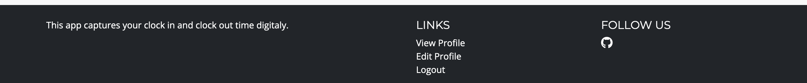

# QR Clock In/Out App

## Screenshot of finished project responsivness

## Emplyee/Subcontractor Clock In/Out App

> This is a simple app that allows employees to clock in and out of work using a QR code or by manual selection. The app enables the user to view their clock in/out history and also allows the admin to view all users clock in/out history. Admin have the ability to add project and the location associated with the project.

Required technologies for this project:

- HTML, CSS, JavaScript, Python+Django
- Relational database

# Live App

- https://qrsigninoutapp-c6f4e2915b2d.herokuapp.com/

## Table of Contents

<a name="contents">Back to top</a>

1. [UX]
2. [Features]
3. [Technologies Used]
4. [Testing]
5. [Deployment]
6. [Credits]

## UX

### User Demographic

This application is designed for employees and subcontractors to clock in and out of project locations. The app is designed to be used on a mobile device. It will enable companies to track the time spent on projects and the location of the employee/subcontractor.

### Wireframes

- Landing Page
  

- User Dashboard
  

- Select Project
  

- Create Project
  

- View/Edit Project
  

- View/Edit Profile
  

### Design

- Color Palette

  Charcoal Grey (#2a2a2a): Provides a strong, neutral base for text and key elements, ensuring excellent readability and a modern aesthetic.
  Vibrant Yellow (#FFD700): Used strategically for interactive elements and call-to-actions, this color stands out against the dark tones and captures user attention.

  This color scheme is professionalism with visual appeal, ensuring a clean and engaging user interface that reflects the efficiency and precision.

- Typography

  The typography choices reflect clarity and contemporary design, featuring:

  Montserrat: Chosen for headings due to its geometric simplicity and modern character, it enhances the visual impact of titles and section headers.
  Open Sans: Selected for body text, Open Sans is clean and legible, making reading seamless and comfortable across all devices.

  The fonts are selected not only for their visual harmony but also for their high readability, contributing to a user-friendly experience.

### User Stories

### Database Schema

#### User Model (django.contrib.auth.models.User)

| id       | Field         |
| -------- | ------------- |
| username | OneToOneField |
| email    | Charfield     |

#### UserProfile Model

| id            | Field         |
| ------------- | ------------- |
| user          | OneToOneField |
| role          | ForeignKey    |
| company_name  | Charfield     |
| date_of_birth | Datefield     |
| phone_number  | Charfield     |
| created_at    | DateTimeField |
| updated_at    | DateTimeField |

#### Role Model

| id          | Field     |
| ----------- | --------- |
| name        | Charfield |
| description | Charfield |

#### Project Model

| id                    | Field         |
| --------------------- | ------------- |
| name                  | Charfield     |
| project_code          | Charfield     |
| project_status        | Charfield     |
| project_url           | Charfield     |
| site_manager_name     | Charfield     |
| site_manager_email    | Charfield     |
| project_manager_name  | Charfield     |
| project_manager_email | Charfield     |
| created_at            | DateTimeField |
| updated_at            | DateTimeField |

#### Location Model

| id          | Field         |
| ----------- | ------------- |
| name        | Charfield     |
| project     | ForeignKey    |
| address     | Charfield     |
| description | Charfield     |
| is_active   | BooleanField  |
| qr_code     | FileField     |
| created_at  | DateTimeField |
| updated_at  | DateTimeField |

#### SignInOut Model

| id            | Field         |
| ------------- | ------------- |
| user          | ForeignKey    |
| location      | ForeignKey    |
| sign_in_time  | DateTimeField |
| sign_out_time | DateTimeField |
| created_at    | DateTimeField |
| updated_at    | DateTimeField |

## Features

### Existing Features

Landing Page

Login

Logout Confirmation

Nav Bar

Footer

User Dashboard

Select Project

Clocked Out

Clocked In

Admin Panel (Projects)

Admin Panel (Clock In/Out)

Create Project

Edit Project and Locations

Delete Project

Add Location

Location Active & Delete Checkbox and QR Download

View Profile

Edit Profile

### Features Left to Implement

- Add a clock in/out button to the user dashboard that will allow the user to open the clock out view of the current clocked in project to save them from having to navigate to the project selection page.

- Admin panel to allow the admin to view all users clock in/out history. This view would have a date filter range and allow the user to filter by subcontractor or company. This dashboard would have charts to display the data in a visual way.

- Subcontractor register, this would allow user to select/search a subcontractor name and set that as their company name.

- Ability to add multiple locations to a project at once.

- When user is registering i would like to have them redirected to a new form to complete their profile information.

- Allow the user to edit their name and email address in the edit profile view.

- Ability to the user to download a csv file of their clock in/out history.

- Ability to the admin user to download a csv file of all users clock in/out history.

- I would like to break down the app into smaller apps to make it easier to maintain and to add new features. As the app was developed needs changed and the app grew in complexity.

- Geo location, i would like to add the ability to track the users location when they clock in/out. This would allow the admin to see where the user was when they clocked in/out.

## Technologies Used

Languages Used

- HTML5

- CSS3

- JavaScript

- Python

Frameworks, Libraries & Programs Used

- Django:

  - The Django web framework was used to create the full-stack web application.

- QR Code Generator:

  - The QR Code Generator was used to generate the QR codes for the locations.

- PostgreSQL:

  - PostgreSQL was used as the object-relational database system.

- ElephantSQL:

  - ElephantSQL was used to host the database.

- Git:

  - Git was used for version control by utilizing the Gitpod terminal to commit to Git and Push to GitHub.

- GitHub:

  - GitHub is used to store the projects code after being pushed from Git.

- Heroku:

  - Heroku was used for the deployed application.

- Gunicorn

  - A Python WSGI HTTP server for UNIX, used to run Python web applications.

- Whitenoise

  - A library for serving static files directly from Django, optimizing content delivery.

- Django Debug Toolbar

  - A configurable set of panels displaying various debug information about the current request/response.

- ASGIRef

  - ASGI (Asynchronous Server Gateway Interface) tools, allowing Django to run asynchronously.

- DJ-Database-URL

  - A utility to help you load your database into your dictionary from the DATABASE_URL environment variable.

- Packaging

  - A core utility for version management and package compatibility.

- PEP 8

  - A tool to check Python code against some of the style conventions in PEP 8.

- Pypng

  - A library for creating PNG (Portable Network Graphics) image files with Python.

- Psycopg2-Binary

  - A PostgreSQL database adapter for Python, providing efficient and secure database connections.

- Sqlparse

  - A non-validating SQL parser for Python, providing support for parsing, splitting, and formatting SQL statements.

- Typing Extensions
  - Backported and experimental type hints for Python.

## Agile Development

Github projects was used for the agile development of this project. The purpose for this was to layout the tasks that needed to be completed and to track the progress of the project.

## Testing

- Testing was completed manually and with automated testing using Django's built in testing framework.

  Views: Testing HTTP responses, context data, etc.

  Models: Testing database interactions, model methods, and validations.

  Forms: Testing form validations and their behavior.
  Templates: Ensuring that templates render correctly with the given context.

  URLs: Checking URL patterns and their resolution.

## Credits

- Extending user model
  https://docs.djangoproject.com/en/dev/topics/auth/customizing/#extending-the-existing-user-model
  https://stackoverflow.com/questions/42478191/how-to-add-extra-fields-in-user-model-and-display-them-in-django-admin
- QRCode generator
  https://www.geeksforgeeks.org/generate-qr-code-using-qrcode-in-python/
- Pylint for Django
- https://stackoverflow.com/questions/71986184/how-can-i-override-str-in-models-py
